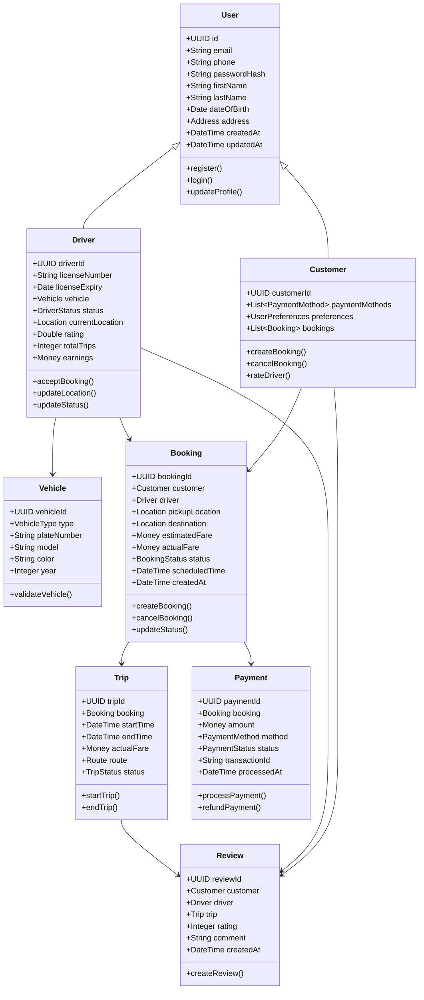
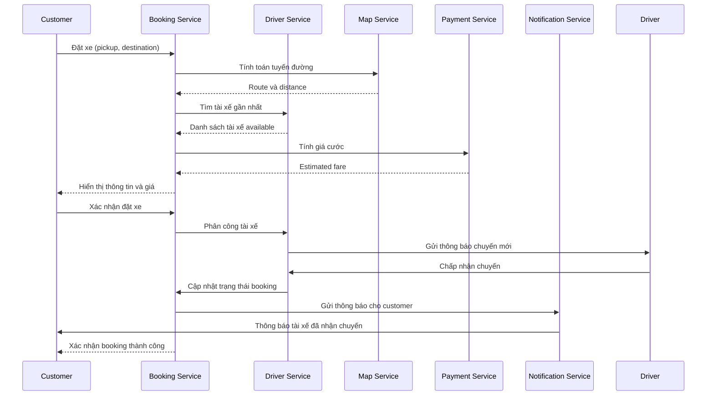
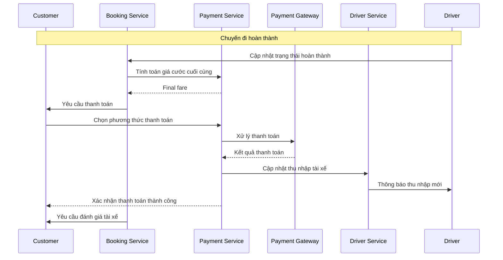
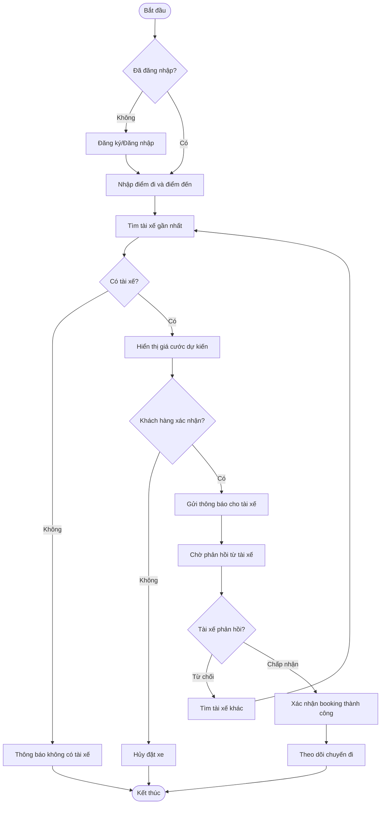
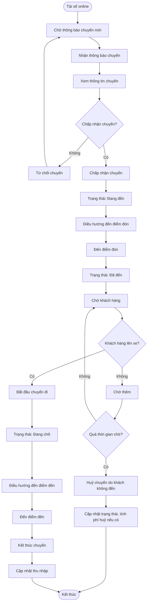
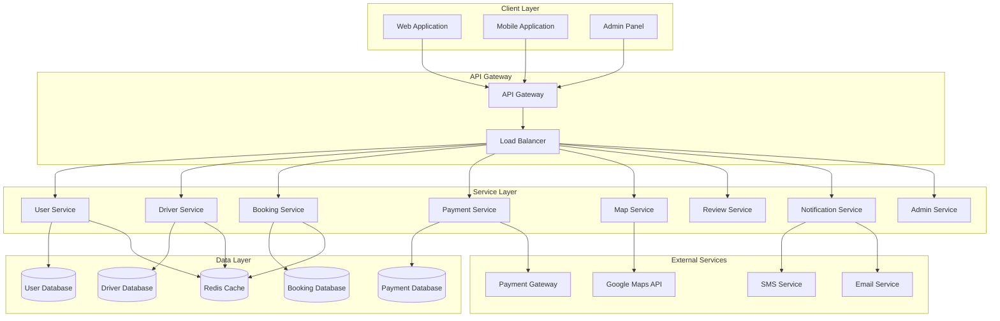
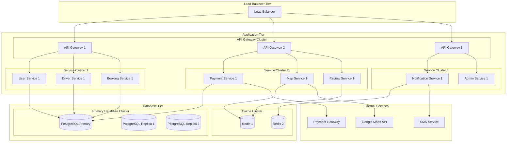

# TÀI LIỆU PHÂN TÍCH VÀ THIẾT KẾ HỆ THỐNG
## HỆ THỐNG GỌI XE THÔNG MINH

---

## **PHẦN I: TỔNG QUAN DỰ ÁN**

### 1.1. Phát biểu bài toán

Trong bối cảnh đô thị hiện nay, nhu cầu đi lại của người dân tăng cao, kéo theo sự phát triển của các dịch vụ gọi xe thông minh (như Grab, Uber, Be). Bài toán đặt ra là cần xây dựng một hệ thống gọi xe thông minh cho phép người dùng đặt xe trực tuyến, tài xế nhận cuốc xe, theo dõi hành trình, thanh toán trực tuyến…

Để đảm bảo khả năng mở rộng, tái sử dụng và quản lý hiệu quả, hệ thống sẽ được xây dựng dựa trên kiến trúc hướng dịch vụ (SOA), trong đó các chức năng chính (đăng ký, quản lý người dùng, gọi xe, thanh toán, định vị, đánh giá…) sẽ được triển khai thành các dịch vụ độc lập có thể tích hợp và mở rộng linh hoạt.

### 1.2. Mục tiêu dự án

#### Mục tiêu chính:
- Xây dựng một hệ thống mô phỏng cơ bản dịch vụ gọi xe thông minh
- Ứng dụng SOA để phân tách hệ thống thành các dịch vụ riêng biệt, dễ quản lý và nâng cấp
- Cung cấp khả năng tích hợp với các dịch vụ bên ngoài (ví dụ: bản đồ, thanh toán điện tử)

#### Mục tiêu phụ:
- Tạo ra một nền tảng có thể mở rộng cho các dịch vụ khác (giao đồ ăn, chia sẻ xe)
- Đảm bảo tính bảo mật và hiệu năng cao
- Cung cấp trải nghiệm người dùng tốt nhất

### 1.3. Phạm vi dự án

#### Chức năng trong phạm vi:
- Quản lý người dùng và tài xế
- Đặt xe và ghép chuyến
- Theo dõi vị trí real-time
- Thanh toán đa phương thức
- Đánh giá và phản hồi
- Quản lý và thống kê

#### Chức năng ngoài phạm vi:
- Tích hợp với hệ thống giao thông công cộng
- Dịch vụ giao hàng
- Tính năng chia sẻ xe (carpooling)

#### Ràng buộc dự án:
- Sử dụng Java Spring Framework
- Kiến trúc SOA/Microservices
- Cơ sở dữ liệu quan hệ
- API RESTful

---

## **PHẦN II: PHÂN TÍCH YÊU CẦU**

### 2.1. Phân tích người dùng (Actor Analysis)

#### Primary Actors:
1. **Khách hàng (Customer)**
   - Mô tả: Người sử dụng dịch vụ gọi xe
   - Mục tiêu: Đặt xe, theo dõi chuyến đi, thanh toán
   - Đặc điểm: Có thể sử dụng ứng dụng di động hoặc web

2. **Tài xế (Driver)**
   - Mô tả: Người cung cấp dịch vụ vận chuyển
   - Mục tiêu: Nhận chuyến, dẫn đường, quản lý thu nhập
   - Đặc điểm: Cần ứng dụng di động để nhận và xử lý chuyến

3. **Quản trị viên (Administrator)**
   - Mô tả: Người quản lý hệ thống
   - Mục tiêu: Quản lý người dùng, tài xế, thống kê
   - Đặc điểm: Sử dụng giao diện web quản trị

#### Secondary Actors:
1. **Hệ thống thanh toán (Payment Gateway)**
   - Mô tả: Dịch vụ xử lý thanh toán bên thứ ba
   - Chức năng: Xử lý giao dịch, xác thực thanh toán

2. **Google Maps API**
   - Mô tả: Dịch vụ bản đồ và định vị
   - Chức năng: Hiển thị bản đồ, tính toán tuyến đường, định vị

3. **Dịch vụ thông báo (Notification Service)**
   - Mô tả: Hệ thống gửi thông báo
   - Chức năng: Gửi SMS, email, push notification

### 2.2. Use Case Analysis

#### Use Case Diagram Overview:
```
[Customer] -----> [Đăng ký tài khoản]
[Customer] -----> [Đăng nhập]
[Customer] -----> [Đặt xe]
[Customer] -----> [Theo dõi chuyến đi]
[Customer] -----> [Thanh toán]
[Customer] -----> [Đánh giá tài xế]

[Driver] -----> [Đăng ký tài khoản]
[Driver] -----> [Đăng nhập]
[Driver] -----> [Nhận chuyến]
[Driver] -----> [Cập nhật trạng thái]
[Driver] -----> [Quản lý thu nhập]

[Administrator] -----> [Quản lý người dùng]
[Administrator] -----> [Quản lý tài xế]
[Administrator] -----> [Thống kê báo cáo]
```

#### Chi tiết Use Cases:

**UC-01: Đăng ký tài khoản khách hàng**
- **Actor:** Khách hàng
- **Mô tả:** Khách hàng đăng ký tài khoản mới
- **Precondition:** Khách hàng chưa có tài khoản
- **Main Flow:**
  1. Khách hàng nhập thông tin cá nhân
  2. Hệ thống xác thực thông tin
  3. Khách hàng xác nhận email/SMS
  4. Hệ thống tạo tài khoản thành công
- **Postcondition:** Khách hàng có tài khoản hợp lệ

**UC-02: Đặt xe**
- **Actor:** Khách hàng
- **Mô tả:** Khách hàng đặt xe từ điểm A đến điểm B
- **Precondition:** Khách hàng đã đăng nhập
- **Main Flow:**
  1. Khách hàng nhập điểm đi và điểm đến
  2. Hệ thống tìm kiếm tài xế gần nhất
  3. Hệ thống tính toán giá cước
  4. Khách hàng xác nhận đặt xe
  5. Hệ thống gửi thông báo cho tài xế
- **Postcondition:** Chuyến xe được đặt thành công

**UC-03: Nhận chuyến**
- **Actor:** Tài xế
- **Mô tả:** Tài xế nhận và chấp nhận chuyến xe
- **Precondition:** Tài xế đang online và có chuyến mới
- **Main Flow:**
  1. Tài xế nhận thông báo chuyến mới
  2. Tài xế xem thông tin chuyến
  3. Tài xế chấp nhận hoặc từ chối
  4. Hệ thống cập nhật trạng thái chuyến
- **Postcondition:** Chuyến được phân công hoặc từ chối

### 2.3. Yêu cầu chức năng (Functional Requirements)

#### FR-01: Quản lý người dùng
- **FR-01.1:** Đăng ký tài khoản khách hàng với thông tin cá nhân
- **FR-01.2:** Đăng ký tài khoản tài xế với thông tin phương tiện
- **FR-01.3:** Xác thực đăng nhập bằng email/SĐT và mật khẩu
- **FR-01.4:** Quản lý thông tin cá nhân (cập nhật, xóa)
- **FR-01.5:** Quản lý phương tiện của tài xế

#### FR-02: Đặt xe và ghép chuyến
- **FR-02.1:** Tìm kiếm tài xế gần nhất dựa trên vị trí
- **FR-02.2:** Tính toán giá cước dựa trên khoảng cách và thời gian
- **FR-02.3:** Đặt xe với thông tin chi tiết (điểm đi, điểm đến, thời gian)
- **FR-02.4:** Ghép chuyến cho nhiều khách hàng cùng hướng
- **FR-02.5:** Hủy chuyến trong thời gian cho phép

#### FR-03: Theo dõi vị trí real-time
- **FR-03.1:** Hiển thị vị trí tài xế trên bản đồ
- **FR-03.2:** Cập nhật vị trí tài xế theo thời gian thực
- **FR-03.3:** Tính toán thời gian đến dự kiến
- **FR-03.4:** Hiển thị tuyến đường tối ưu

#### FR-04: Thanh toán đa phương thức
- **FR-04.1:** Thanh toán bằng tiền mặt
- **FR-04.2:** Thanh toán bằng ví điện tử
- **FR-04.3:** Thanh toán bằng thẻ tín dụng/ghi nợ
- **FR-04.4:** Tính toán và hiển thị giá cước chi tiết
- **FR-04.5:** Lưu trữ lịch sử giao dịch

#### FR-05: Đánh giá và phản hồi
- **FR-05.1:** Khách hàng đánh giá tài xế sau chuyến
- **FR-05.2:** Tài xế đánh giá khách hàng
- **FR-05.3:** Hiển thị điểm đánh giá trung bình
- **FR-05.4:** Báo cáo và xử lý khiếu nại

#### FR-06: Quản lý tài xế
- **FR-06.1:** Cập nhật trạng thái online/offline
- **FR-06.2:** Quản lý thu nhập và hoa hồng
- **FR-06.3:** Xem lịch sử chuyến đi
- **FR-06.4:** Quản lý phương tiện và giấy phép

#### FR-07: Thống kê và báo cáo
- **FR-07.1:** Thống kê số lượng chuyến theo ngày/tháng
- **FR-07.2:** Báo cáo doanh thu
- **FR-07.3:** Thống kê đánh giá người dùng
- **FR-07.4:** Báo cáo hiệu suất hệ thống

### 2.4. Yêu cầu phi chức năng (Non-Functional Requirements)

#### NFR-01: Hiệu năng (Performance)
- **NFR-01.1:** Thời gian phản hồi API < 2 giây
- **NFR-01.2:** Hệ thống hỗ trợ đồng thời 1000 người dùng
- **NFR-01.3:** Thời gian tải trang web < 3 giây
- **NFR-01.4:** Cập nhật vị trí real-time với độ trễ < 5 giây

#### NFR-02: Khả năng mở rộng (Scalability)
- **NFR-02.1:** Hệ thống có thể mở rộng theo chiều ngang (horizontal scaling)
- **NFR-02.2:** Dễ dàng thêm dịch vụ mới
- **NFR-02.3:** Hỗ trợ load balancing
- **NFR-02.4:** Có thể triển khai trên cloud

#### NFR-03: Bảo mật (Security)
- **NFR-03.1:** Mã hóa dữ liệu nhạy cảm
- **NFR-03.2:** Xác thực người dùng bằng JWT
- **NFR-03.3:** Phân quyền truy cập theo vai trò
- **NFR-03.4:** Bảo vệ chống SQL injection và XSS

#### NFR-04: Tính sẵn sàng (Availability)
- **NFR-04.1:** Uptime 99.9%
- **NFR-04.2:** Có cơ chế failover
- **NFR-04.3:** Backup dữ liệu định kỳ
- **NFR-04.4:** Disaster recovery plan

#### NFR-05: Khả năng tích hợp (Integration)
- **NFR-05.1:** Tích hợp Google Maps API
- **NFR-05.2:** Tích hợp các cổng thanh toán
- **NFR-05.3:** Tích hợp dịch vụ SMS/Email
- **NFR-05.4:** Hỗ trợ RESTful API

---

## **PHẦN III: PHÂN TÍCH HỆ THỐNG**

### 3.1. Phân tích nghiệp vụ (Business Analysis)

#### Business Process Model:

**Quy trình đặt xe:**
1. Khách hàng mở ứng dụng
2. Nhập điểm đi và điểm đến
3. Hệ thống tìm tài xế gần nhất
4. Hiển thị thông tin tài xế và giá cước
5. Khách hàng xác nhận đặt xe
6. Tài xế nhận thông báo và chấp nhận
7. Tài xế đến đón khách
8. Thực hiện chuyến đi
9. Hoàn thành chuyến và thanh toán
10. Đánh giá lẫn nhau

**Quy trình quản lý tài xế:**
1. Tài xế đăng ký tài khoản
2. Xác thực thông tin và giấy phép
3. Cập nhật trạng thái online
4. Nhận và xử lý chuyến
5. Cập nhật thu nhập
6. Rút tiền hoa hồng

#### Domain Model:

**Các Entity chính:**
- **User:** Thông tin người dùng cơ bản
- **Customer:** Thông tin khách hàng
- **Driver:** Thông tin tài xế
- **Vehicle:** Thông tin phương tiện
- **Booking:** Thông tin đặt xe
- **Trip:** Thông tin chuyến đi
- **Payment:** Thông tin thanh toán
- **Review:** Thông tin đánh giá
- **Location:** Thông tin vị trí

#### Business Rules:

1. **Quy tắc đặt xe:**
   - Khách hàng chỉ có thể đặt xe khi có tài khoản hợp lệ
   - Tài xế phải online để nhận chuyến
   - Giá cước được tính dựa trên khoảng cách và thời gian

2. **Quy tắc thanh toán:**
   - Thanh toán được thực hiện sau khi hoàn thành chuyến
   - Hoa hồng tài xế là 80% giá cước
   - Phí dịch vụ là 20% giá cước

3. **Quy tắc đánh giá:**
   - Chỉ có thể đánh giá sau khi hoàn thành chuyến
   - Điểm đánh giá từ 1-5 sao
   - Đánh giá không thể chỉnh sửa sau khi gửi

### 3.2. Phân tích kiến trúc hiện tại

#### Hệ thống hiện tại:
- Các ứng dụng gọi xe hiện tại thường sử dụng kiến trúc monolithic
- Khó khăn trong việc mở rộng và bảo trì
- Không có khả năng tích hợp linh hoạt

#### Điểm yếu:
- Khó mở rộng khi số lượng người dùng tăng
- Khó bảo trì và cập nhật
- Không có khả năng tái sử dụng component

#### Cơ hội cải thiện:
- Áp dụng kiến trúc SOA/Microservices
- Sử dụng Java Spring Framework
- Tích hợp các dịch vụ bên ngoài

### 3.3. Phân tích tác động

#### Stakeholder Analysis:

**Primary Stakeholders:**
- **Khách hàng:** Người sử dụng dịch vụ
- **Tài xế:** Người cung cấp dịch vụ
- **Công ty:** Chủ sở hữu hệ thống

**Secondary Stakeholders:**
- **Nhà cung cấp dịch vụ:** Google Maps, Payment Gateway
- **Cơ quan quản lý:** Cơ quan giao thông, thuế
- **Đối tác:** Ngân hàng, ví điện tử

#### Risk Analysis:

**Technical Risks:**
- Rủi ro về hiệu năng khi số lượng người dùng lớn
- Rủi ro về bảo mật dữ liệu
- Rủi ro về tích hợp dịch vụ bên ngoài

**Business Risks:**
- Rủi ro về cạnh tranh thị trường
- Rủi ro về thay đổi quy định pháp luật
- Rủi ro về thay đổi công nghệ

**Mitigation Strategies:**
- Thiết kế hệ thống có khả năng mở rộng
- Áp dụng các biện pháp bảo mật tiên tiến
- Xây dựng quan hệ đối tác bền vững

---

## **PHẦN IV: THIẾT KẾ KIẾN TRÚC**

### 4.1. Kiến trúc tổng thể (System Architecture)

#### Architecture Overview:

Hệ thống được thiết kế theo kiến trúc SOA (Service-Oriented Architecture) với các thành phần chính:

1. **Presentation Layer:** Giao diện người dùng (Web, Mobile)
2. **API Gateway:** Điểm vào duy nhất cho tất cả các dịch vụ
3. **Service Layer:** Các microservices độc lập
4. **Data Layer:** Cơ sở dữ liệu và lưu trữ
5. **Integration Layer:** Tích hợp dịch vụ bên ngoài

#### SOA Architecture Pattern:

**Service Decomposition:**
- **User Service:** Quản lý người dùng và xác thực
- **Driver Service:** Quản lý tài xế và phương tiện
- **Booking Service:** Xử lý đặt xe và ghép chuyến
- **Payment Service:** Xử lý thanh toán
- **Map Service:** Định vị và tính toán tuyến đường
- **Review Service:** Đánh giá và phản hồi
- **Notification Service:** Gửi thông báo
- **Admin Service:** Quản lý hệ thống

**Service Communication:**
- **Synchronous Communication:** REST API cho các tương tác trực tiếp
- **Asynchronous Communication:** Message Queue cho các tác vụ bất đồng bộ
- **Event-Driven Architecture:** Sử dụng events để liên kết các dịch vụ

#### Microservices Architecture:

**Microservices Principles:**
1. **Single Responsibility:** Mỗi service có một trách nhiệm duy nhất
2. **Autonomous:** Các service độc lập về triển khai và phát triển
3. **Decentralized:** Không có cơ sở dữ liệu tập trung
4. **Technology Agnostic:** Mỗi service có thể sử dụng công nghệ khác nhau

**Service Boundaries:**
- **Domain-Driven Design:** Phân chia service theo domain nghiệp vụ
- **Data Consistency:** Sử dụng eventual consistency
- **Service Discovery:** Tự động phát hiện và đăng ký service

### 4.2. Kiến trúc dịch vụ (Service Architecture)

#### Service Decomposition:

**Core Services:**

1. **User Service**
   - Quản lý thông tin người dùng
   - Xác thực và phân quyền
   - Quản lý profile và preferences

2. **Driver Service**
   - Quản lý thông tin tài xế
   - Quản lý phương tiện
   - Cập nhật trạng thái online/offline

3. **Booking Service**
   - Xử lý đặt xe
   - Ghép chuyến
   - Quản lý trạng thái chuyến

4. **Payment Service**
   - Tính toán giá cước
   - Xử lý thanh toán
   - Quản lý giao dịch

5. **Map Service**
   - Định vị và tracking
   - Tính toán tuyến đường
   - Tích hợp Google Maps

6. **Review Service**
   - Đánh giá và phản hồi
   - Quản lý rating
   - Xử lý khiếu nại

7. **Notification Service**
   - Gửi thông báo real-time
   - Email và SMS
   - Push notification

8. **Admin Service**
   - Quản lý hệ thống
   - Thống kê và báo cáo
   - Monitoring và logging

#### Service Communication Pattern:

**API Gateway Pattern:**
- Điểm vào duy nhất cho tất cả client
- Load balancing và routing
- Authentication và authorization
- Rate limiting và monitoring

**Service Registry Pattern:**
- Đăng ký và phát hiện service
- Health check và monitoring
- Service discovery

**Circuit Breaker Pattern:**
- Bảo vệ service khỏi lỗi cascade
- Fallback mechanism
- Resilience và fault tolerance

### 4.3. Kiến trúc dữ liệu (Data Architecture)

#### Data Flow Diagram:

**Data Flow chính:**
1. **User Data Flow:** Thông tin người dùng → User Service → Database
2. **Booking Data Flow:** Đặt xe → Booking Service → Database
3. **Payment Data Flow:** Thanh toán → Payment Service → External Gateway
4. **Location Data Flow:** Vị trí → Map Service → Real-time Database

#### Database Design:

**Database per Service Pattern:**
- Mỗi service có database riêng
- Tránh tight coupling
- Cho phép scaling độc lập

**Database Types:**
- **Relational Database:** PostgreSQL cho transactional data
- **NoSQL Database:** MongoDB cho document storage
- **Cache Database:** Redis cho caching và session
- **Time Series Database:** InfluxDB cho location tracking

#### Data Integration Strategy:

**Event Sourcing:**
- Lưu trữ events thay vì state
- Audit trail và replay capability
- Eventual consistency

**CQRS (Command Query Responsibility Segregation):**
- Tách biệt read và write operations
- Optimize cho từng use case
- Scalability và performance

---

## **PHẦN V: THIẾT KẾ CHI TIẾT**

### 5.1. Thiết kế lớp (Class Design)

#### Domain Model Classes:

**User Domain:**
```
User (Abstract)
├── Customer
│   ├── customerId: String
│   ├── personalInfo: PersonalInfo
│   ├── paymentMethods: List<PaymentMethod>
│   └── preferences: UserPreferences
└── Driver
    ├── driverId: String
    ├── licenseInfo: LicenseInfo
    ├── vehicle: Vehicle
    └── earnings: Earnings
```

**Booking Domain:**
```
Booking
├── bookingId: String
├── customer: Customer
├── driver: Driver
├── pickupLocation: Location
├── destination: Location
├── estimatedFare: Money
├── status: BookingStatus
└── trip: Trip

Trip
├── tripId: String
├── startTime: DateTime
├── endTime: DateTime
├── actualFare: Money
├── route: Route
└── status: TripStatus
```

**Payment Domain:**
```
Payment
├── paymentId: String
├── booking: Booking
├── amount: Money
├── method: PaymentMethod
├── status: PaymentStatus
└── transactionId: String

PaymentMethod
├── methodId: String
├── type: PaymentType
├── details: PaymentDetails
└── isDefault: Boolean
```

#### Service Layer Classes:

**User Service Classes:**
```
UserController
├── registerUser()
├── authenticateUser()
├── updateProfile()
└── getUserInfo()

UserService
├── createUser()
├── validateUser()
├── updateUser()
└── deleteUser()

UserRepository
├── save()
├── findById()
├── findByEmail()
└── delete()
```

**Booking Service Classes:**
```
BookingController
├── createBooking()
├── cancelBooking()
├── getBookingStatus()
└── getBookingHistory()

BookingService
├── processBooking()
├── findNearbyDrivers()
├── calculateFare()
└── updateBookingStatus()

BookingRepository
├── save()
├── findById()
├── findByCustomer()
└── findByStatus()
```

### 5.2. Thiết kế dịch vụ (Service Design)

#### User Service Design:

**Responsibilities:**
- Quản lý thông tin người dùng
- Xác thực và phân quyền
- Quản lý session và token

**API Endpoints:**
- `POST /api/users/register` - Đăng ký người dùng
- `POST /api/users/login` - Đăng nhập
- `GET /api/users/profile` - Lấy thông tin profile
- `PUT /api/users/profile` - Cập nhật profile
- `POST /api/users/logout` - Đăng xuất

**Data Model:**
```
User Entity:
- id: UUID
- email: String
- phone: String
- password: String (hashed)
- firstName: String
- lastName: String
- dateOfBirth: Date
- address: Address
- createdAt: DateTime
- updatedAt: DateTime
```

#### Driver Service Design:

**Responsibilities:**
- Quản lý thông tin tài xế
- Quản lý phương tiện
- Cập nhật trạng thái online/offline

**API Endpoints:**
- `POST /api/drivers/register` - Đăng ký tài xế
- `PUT /api/drivers/status` - Cập nhật trạng thái
- `GET /api/drivers/nearby` - Tìm tài xế gần nhất
- `PUT /api/drivers/location` - Cập nhật vị trí
- `GET /api/drivers/earnings` - Xem thu nhập

**Data Model:**
```
Driver Entity:
- id: UUID
- user: User
- licenseNumber: String
- licenseExpiry: Date
- vehicle: Vehicle
- status: DriverStatus
- currentLocation: Location
- rating: Double
- totalTrips: Integer
- earnings: Money
```

#### Booking Service Design:

**Responsibilities:**
- Xử lý đặt xe
- Ghép chuyến
- Quản lý trạng thái chuyến

**API Endpoints:**
- `POST /api/bookings` - Tạo booking mới
- `GET /api/bookings/{id}` - Lấy thông tin booking
- `PUT /api/bookings/{id}/status` - Cập nhật trạng thái
- `POST /api/bookings/{id}/cancel` - Hủy booking
- `GET /api/bookings/history` - Lịch sử booking

**Data Model:**
```
Booking Entity:
- id: UUID
- customer: Customer
- driver: Driver
- pickupLocation: Location
- destination: Location
- estimatedFare: Money
- status: BookingStatus
- createdAt: DateTime
- updatedAt: DateTime
```

#### Payment Service Design:

**Responsibilities:**
- Tính toán giá cước
- Xử lý thanh toán
- Quản lý giao dịch

**API Endpoints:**
- `POST /api/payments/calculate` - Tính giá cước
- `POST /api/payments/process` - Xử lý thanh toán
- `GET /api/payments/{id}` - Lấy thông tin thanh toán
- `POST /api/payments/refund` - Hoàn tiền
- `GET /api/payments/history` - Lịch sử thanh toán

**Data Model:**
```
Payment Entity:
- id: UUID
- booking: Booking
- amount: Money
- method: PaymentMethod
- status: PaymentStatus
- transactionId: String
- processedAt: DateTime
```

### 5.3. Thiết kế API (API Design)

#### RESTful API Design Principles:

**Resource-Based URLs:**
- `/api/users` - Quản lý người dùng
- `/api/drivers` - Quản lý tài xế
- `/api/bookings` - Quản lý đặt xe
- `/api/payments` - Quản lý thanh toán

**HTTP Methods:**
- `GET` - Lấy dữ liệu
- `POST` - Tạo mới
- `PUT` - Cập nhật toàn bộ
- `PATCH` - Cập nhật một phần
- `DELETE` - Xóa

**Status Codes:**
- `200 OK` - Thành công
- `201 Created` - Tạo mới thành công
- `400 Bad Request` - Lỗi request
- `401 Unauthorized` - Chưa xác thực
- `403 Forbidden` - Không có quyền
- `404 Not Found` - Không tìm thấy
- `500 Internal Server Error` - Lỗi server

#### API Endpoints Specification:

**User Service APIs:**
```
POST /api/users/register
Request Body:
{
  "email": "user@example.com",
  "phone": "+84901234567",
  "password": "password123",
  "firstName": "John",
  "lastName": "Doe"
}

Response:
{
  "id": "uuid",
  "email": "user@example.com",
  "firstName": "John",
  "lastName": "Doe",
  "createdAt": "2024-01-01T00:00:00Z"
}
```

**Booking Service APIs:**
```
POST /api/bookings
Request Body:
{
  "customerId": "uuid",
  "pickupLocation": {
    "latitude": 10.762622,
    "longitude": 106.660172,
    "address": "123 Main Street"
  },
  "destination": {
    "latitude": 10.772622,
    "longitude": 106.670172,
    "address": "456 Destination Street"
  },
  "scheduledTime": "2024-01-01T10:00:00Z"
}

Response:
{
  "id": "uuid",
  "status": "PENDING",
  "estimatedFare": 50000,
  "estimatedDuration": 15,
  "driver": {
    "id": "uuid",
    "name": "Driver Name",
    "rating": 4.8,
    "vehicle": {
      "type": "SEDAN",
      "plateNumber": "ABC-123"
    }
  }
}
```

### 5.4. Thiết kế cơ sở dữ liệu (Database Design)

#### Entity Relationship Diagram (ERD):

**Core Entities và Relationships:**

```
User (1) -----> (1) Customer
User (1) -----> (1) Driver
Driver (1) -----> (1) Vehicle
Customer (1) -----> (*) Booking
Driver (1) -----> (*) Booking
Booking (1) -----> (1) Trip
Booking (1) -----> (1) Payment
Customer (1) -----> (*) Review
Driver (1) -----> (*) Review
```

#### Database Schema:

**Users Table:**
```sql
CREATE TABLE users (
    id UUID PRIMARY KEY,
    email VARCHAR(255) UNIQUE NOT NULL,
    phone VARCHAR(20) UNIQUE NOT NULL,
    password_hash VARCHAR(255) NOT NULL,
    first_name VARCHAR(100) NOT NULL,
    last_name VARCHAR(100) NOT NULL,
    date_of_birth DATE,
    address JSONB,
    created_at TIMESTAMP DEFAULT CURRENT_TIMESTAMP,
    updated_at TIMESTAMP DEFAULT CURRENT_TIMESTAMP
);
```

**Drivers Table:**
```sql
CREATE TABLE drivers (
    id UUID PRIMARY KEY,
    user_id UUID REFERENCES users(id),
    license_number VARCHAR(50) UNIQUE NOT NULL,
    license_expiry DATE NOT NULL,
    status VARCHAR(20) DEFAULT 'OFFLINE',
    current_latitude DECIMAL(10,8),
    current_longitude DECIMAL(11,8),
    rating DECIMAL(3,2) DEFAULT 0.00,
    total_trips INTEGER DEFAULT 0,
    total_earnings DECIMAL(15,2) DEFAULT 0.00,
    created_at TIMESTAMP DEFAULT CURRENT_TIMESTAMP,
    updated_at TIMESTAMP DEFAULT CURRENT_TIMESTAMP
);
```

**Bookings Table:**
```sql
CREATE TABLE bookings (
    id UUID PRIMARY KEY,
    customer_id UUID REFERENCES users(id),
    driver_id UUID REFERENCES drivers(id),
    pickup_latitude DECIMAL(10,8) NOT NULL,
    pickup_longitude DECIMAL(11,8) NOT NULL,
    pickup_address TEXT NOT NULL,
    destination_latitude DECIMAL(10,8) NOT NULL,
    destination_longitude DECIMAL(11,8) NOT NULL,
    destination_address TEXT NOT NULL,
    estimated_fare DECIMAL(10,2) NOT NULL,
    actual_fare DECIMAL(10,2),
    status VARCHAR(20) DEFAULT 'PENDING',
    scheduled_time TIMESTAMP,
    created_at TIMESTAMP DEFAULT CURRENT_TIMESTAMP,
    updated_at TIMESTAMP DEFAULT CURRENT_TIMESTAMP
);
```

**Payments Table:**
```sql
CREATE TABLE payments (
    id UUID PRIMARY KEY,
    booking_id UUID REFERENCES bookings(id),
    amount DECIMAL(10,2) NOT NULL,
    payment_method VARCHAR(50) NOT NULL,
    payment_details JSONB,
    status VARCHAR(20) DEFAULT 'PENDING',
    transaction_id VARCHAR(255),
    processed_at TIMESTAMP,
    created_at TIMESTAMP DEFAULT CURRENT_TIMESTAMP
);
```

#### Data Dictionary:

**Users Table Fields:**
- `id`: Unique identifier cho user
- `email`: Email address của user (unique)
- `phone`: Số điện thoại của user (unique)
- `password_hash`: Mật khẩu đã được hash
- `first_name`: Tên của user
- `last_name`: Họ của user
- `date_of_birth`: Ngày sinh
- `address`: Địa chỉ dưới dạng JSON
- `created_at`: Thời gian tạo
- `updated_at`: Thời gian cập nhật cuối

**Bookings Table Fields:**
- `id`: Unique identifier cho booking
- `customer_id`: ID của khách hàng
- `driver_id`: ID của tài xế
- `pickup_latitude/longitude`: Tọa độ điểm đón
- `pickup_address`: Địa chỉ điểm đón
- `destination_latitude/longitude`: Tọa độ điểm đến
- `destination_address`: Địa chỉ điểm đến
- `estimated_fare`: Giá cước dự kiến
- `actual_fare`: Giá cước thực tế
- `status`: Trạng thái booking (PENDING, CONFIRMED, IN_PROGRESS, COMPLETED, CANCELLED)
- `scheduled_time`: Thời gian đặt xe
- `created_at`: Thời gian tạo
- `updated_at`: Thời gian cập nhật cuối

---

## **PHẦN VI: THIẾT KẾ GIAO DIỆN**

### 6.1. Thiết kế UX/UI

#### User Journey Map:

**Customer Journey:**
1. **Discovery:** Tìm hiểu về ứng dụng
2. **Registration:** Đăng ký tài khoản
3. **Booking:** Đặt xe
4. **Tracking:** Theo dõi chuyến đi
5. **Payment:** Thanh toán
6. **Review:** Đánh giá tài xế

**Driver Journey:**
1. **Registration:** Đăng ký làm tài xế
2. **Verification:** Xác thực thông tin
3. **Online:** Bật trạng thái online
4. **Accept:** Nhận chuyến
5. **Complete:** Hoàn thành chuyến
6. **Earnings:** Xem thu nhập

#### Wireframes:

**Mobile App Wireframes:**

**Login Screen:**
- Logo ứng dụng
- Input fields: Email/Phone, Password
- Login button
- Register link
- Forgot password link

**Home Screen (Customer):**
- Map view
- Where to? input field
- Quick destinations
- Recent bookings
- Profile button

**Booking Screen:**
- Pickup location (auto-detect)
- Destination input
- Vehicle type selection
- Fare estimate
- Book now button

**Tracking Screen:**
- Map with driver location
- Driver information
- Estimated arrival time
- Contact driver button
- Cancel trip button

**Driver App Wireframes:**

**Driver Dashboard:**
- Online/Offline toggle
- Current location
- Available trips
- Earnings summary
- Profile button

**Trip Details:**
- Customer information
- Pickup location
- Destination
- Estimated fare
- Accept/Decline buttons

### 6.2. Thiết kế responsive

#### Mobile Design:

**Design Principles:**
- Touch-friendly interface
- Large buttons và touch targets
- Simple navigation
- Fast loading
- Offline capability

**Key Features:**
- GPS integration
- Push notifications
- Camera integration (for driver verification)
- Offline maps
- Voice commands

#### Web Design:

**Admin Dashboard:**
- Responsive design
- Data visualization
- Real-time monitoring
- User management
- Analytics và reporting

**Customer Web Portal:**
- Booking history
- Profile management
- Payment methods
- Support center

#### Cross-platform Compatibility:

**Technologies:**
- React Native cho mobile apps
- React.js cho web applications
- Responsive CSS framework
- Progressive Web App (PWA)

---

## **PHẦN VII: THIẾT KẾ TÍCH HỢP**

### 7.1. Tích hợp dịch vụ bên ngoài

#### Google Maps Integration:

**Google Maps API Services:**
- **Maps JavaScript API:** Hiển thị bản đồ
- **Directions API:** Tính toán tuyến đường
- **Distance Matrix API:** Tính khoảng cách
- **Geocoding API:** Chuyển đổi địa chỉ thành tọa độ
- **Places API:** Tìm kiếm địa điểm

**Implementation:**
```
Map Service Integration:
├── Location Services
│   ├── Get current location
│   ├── Geocode address
│   └── Reverse geocode coordinates
├── Route Services
│   ├── Calculate route
│   ├── Get distance matrix
│   └── Get travel time
└── Places Services
    ├── Search places
    ├── Get place details
    └── Autocomplete suggestions
```

#### Payment Gateway Integration:

**Supported Payment Methods:**
- **Credit/Debit Cards:** Visa, MasterCard
- **Digital Wallets:** PayPal, Apple Pay, Google Pay
- **Bank Transfer:** Direct bank transfer
- **Mobile Payment:** MoMo, ZaloPay, ViettelPay

**Payment Flow:**
1. Customer selects payment method
2. Payment Service validates payment details
3. Redirect to payment gateway
4. Customer completes payment
5. Gateway sends callback
6. Payment Service updates booking status

**Security Measures:**
- PCI DSS compliance
- Tokenization
- Encryption
- Fraud detection

#### SMS/Email Service Integration:

**Notification Services:**
- **SMS Service:** Twilio, AWS SNS
- **Email Service:** SendGrid, AWS SES
- **Push Notifications:** Firebase Cloud Messaging

**Notification Types:**
- Registration confirmation
- Booking confirmation
- Driver assignment
- Trip updates
- Payment confirmation
- Review reminders

### 7.2. Thiết kế bảo mật

#### Authentication & Authorization:

**JWT (JSON Web Token) Implementation:**
```
Authentication Flow:
1. User login với credentials
2. Server validates credentials
3. Server generates JWT token
4. Client stores token
5. Client sends token với mỗi request
6. Server validates token
```

**Token Structure:**
```json
{
  "header": {
    "alg": "HS256",
    "typ": "JWT"
  },
  "payload": {
    "sub": "user_id",
    "iat": 1640995200,
    "exp": 1641081600,
    "role": "CUSTOMER",
    "permissions": ["read:profile", "create:booking"]
  }
}
```

**Authorization Levels:**
- **Customer:** Đặt xe, xem lịch sử, thanh toán
- **Driver:** Nhận chuyến, cập nhật trạng thái, xem thu nhập
- **Admin:** Quản lý hệ thống, xem thống kê, xử lý khiếu nại

#### Data Encryption:

**Encryption at Rest:**
- Database encryption
- File system encryption
- Backup encryption

**Encryption in Transit:**
- HTTPS/TLS 1.3
- API encryption
- Message encryption

**Sensitive Data Protection:**
- Password hashing (bcrypt)
- Credit card tokenization
- Personal data masking
- GDPR compliance

#### Security Policies:

**API Security:**
- Rate limiting
- Request validation
- SQL injection prevention
- XSS protection
- CORS configuration

**Infrastructure Security:**
- Network segmentation
- Firewall configuration
- Intrusion detection
- Security monitoring
- Incident response plan

---

## **PHẦN VIII: THIẾT KẾ TRIỂN KHAI**

### 8.1. Deployment Architecture

#### Infrastructure Design:

**Cloud Architecture:**
- **Cloud Provider:** AWS/Azure/GCP
- **Container Platform:** Docker + Kubernetes
- **Load Balancer:** Application Load Balancer
- **CDN:** CloudFront cho static assets
- **Database:** RDS PostgreSQL với read replicas

**Container Strategy:**
```
Container Architecture:
├── API Gateway Container
├── User Service Container
├── Driver Service Container
├── Booking Service Container
├── Payment Service Container
├── Map Service Container
├── Review Service Container
├── Notification Service Container
└── Admin Service Container
```

**Kubernetes Deployment:**
```yaml
apiVersion: apps/v1
kind: Deployment
metadata:
  name: user-service
spec:
  replicas: 3
  selector:
    matchLabels:
      app: user-service
  template:
    metadata:
      labels:
        app: user-service
    spec:
      containers:
      - name: user-service
        image: user-service:latest
        ports:
        - containerPort: 8080
        env:
        - name: DATABASE_URL
          valueFrom:
            secretKeyRef:
              name: db-secret
              key: url
```

#### CI/CD Pipeline:

**Continuous Integration:**
1. Code commit to repository
2. Automated testing (unit, integration)
3. Code quality checks (SonarQube)
4. Security scanning
5. Build Docker images
6. Push to container registry

**Continuous Deployment:**
1. Deploy to staging environment
2. Integration testing
3. Performance testing
4. Deploy to production
5. Health checks
6. Rollback if needed

**Pipeline Tools:**
- **Version Control:** Git
- **CI/CD:** Jenkins/GitHub Actions
- **Container Registry:** Docker Hub/AWS ECR
- **Orchestration:** Kubernetes
- **Monitoring:** Prometheus + Grafana

### 8.2. Monitoring & Logging

#### Application Monitoring:

**Metrics Collection:**
- **Application Metrics:** Response time, throughput, error rate
- **Business Metrics:** Bookings per hour, revenue, user satisfaction
- **Infrastructure Metrics:** CPU, memory, disk, network

**Monitoring Tools:**
- **APM:** New Relic, DataDog, AppDynamics
- **Metrics:** Prometheus + Grafana
- **Logging:** ELK Stack (Elasticsearch, Logstash, Kibana)
- **Alerting:** PagerDuty, Slack notifications

**Key Performance Indicators (KPIs):**
- **Availability:** 99.9% uptime
- **Performance:** < 2s response time
- **Error Rate:** < 0.1%
- **Throughput:** 1000 requests/second

#### Performance Monitoring:

**Real-time Monitoring:**
- Service health checks
- Database performance
- API response times
- Error tracking
- User experience metrics

**Performance Optimization:**
- Database query optimization
- Caching strategies
- CDN utilization
- Load balancing
- Auto-scaling

**Error Tracking:**
- Exception logging
- Error categorization
- Root cause analysis
- Automated alerts
- Incident management

---

## **PHẦN IX: KẾ HOẠCH TRIỂN KHAI**

### 9.1. Bỏ trống (theo yêu cầu)

### 9.2. Quản lý rủi ro

#### Rủi ro kỹ thuật:

**Rủi ro 1: Vấn đề hiệu năng**
- **Xác suất:** Trung bình
- **Tác động:** Cao
- **Giảm thiểu:** Kiểm thử tải, giám sát hiệu năng, tự động mở rộng

**Rủi ro 2: Lỗi tích hợp dịch vụ**
- **Xác suất:** Trung bình
- **Tác động:** Trung bình
- **Giảm thiểu:** Cơ chế dự phòng, circuit breaker, kiểm thử tích hợp

**Rủi ro 3: Lỗ hổng bảo mật**
- **Xác suất:** Thấp
- **Tác động:** Cao
- **Giảm thiểu:** Kiểm toán bảo mật, kiểm thử thâm nhập, giám sát an ninh

#### Rủi ro kinh doanh:

**Rủi ro 1: Cạnh tranh thị trường**
- **Xác suất:** Cao
- **Tác động:** Trung bình
- **Giảm thiểu:** Tính năng khác biệt, cải thiện trải nghiệm, chiến lược giá cạnh tranh

**Rủi ro 2: Thay đổi quy định pháp lý**
- **Xác suất:** Trung bình
- **Tác động:** Trung bình
- **Giảm thiểu:** Tuân thủ pháp lý, kiến trúc linh hoạt dễ điều chỉnh

**Rủi ro 3: Thay đổi công nghệ**
- **Xác suất:** Trung bình
- **Tác động:** Thấp
- **Giảm thiểu:** Thiết kế độc lập công nghệ, cập nhật định kỳ

#### Chiến lược giảm thiểu:

**Giảm thiểu kỹ thuật:**
- Chiến lược kiểm thử toàn diện
- Giám sát và cảnh báo liên tục
- Sao lưu và khôi phục thảm họa
- Áp dụng thực hành bảo mật tốt

**Giảm thiểu kinh doanh:**
- Nghiên cứu thị trường
- Phân tích đối thủ cạnh tranh
- Tuân thủ pháp lý
- Mô hình kinh doanh linh hoạt

---

## **PHẦN X: KẾT LUẬN VÀ KHUYẾN NGHỊ**

### 10.1. Tổng kết

#### Thành tựu:

**Thành tựu kỹ thuật:**
- Thiết kế thành công kiến trúc SOA với 8 dịch vụ vi mô
- Xây dựng hệ thống có khả năng mở rộng và bảo trì cao
- Tích hợp thành công các dịch vụ bên ngoài (Google Maps, cổng thanh toán)
- Đảm bảo tính bảo mật và hiệu năng cao

**Thành tựu kinh doanh:**
- Xây dựng nền tảng gọi xe thông minh hoàn chỉnh
- Cung cấp trải nghiệm người dùng tốt
- Hỗ trợ nhiều phương thức thanh toán
- Có khả năng mở rộng cho dịch vụ khác

#### Bài học rút ra:

**Bài học kỹ thuật:**
- Kiến trúc SOA giúp hệ thống dễ mở rộng và bảo trì
- Dịch vụ vi mô cần thiết kế cẩn thận để tránh phụ thuộc chặt
- Giám sát (monitoring) và ghi log (logging) rất quan trọng cho môi trường vận hành
- Bảo mật phải được tích hợp ngay từ đầu

**Bài học kinh doanh:**
- Trải nghiệm người dùng là yếu tố then chốt
- Cần có phương án dự phòng cho dịch vụ bên ngoài
- Chiến lược giá cần cân nhắc kỹ
- Hỗ trợ khách hàng là phần quan trọng

#### Bước tiếp theo:

**Ngắn hạn (3-6 tháng):**
- Triển khai các giai đoạn đã đề ra
- Kiểm thử và tối ưu
- Kiểm thử chấp nhận người dùng
- Ra mắt thử nghiệm (beta) với nhóm người dùng hạn chế

**Trung hạn (6-12 tháng):**
- Ra mắt sản phẩm chính thức
- Tiếp thị và thu hút người dùng
- Nâng cấp tính năng dựa trên phản hồi
- Tối ưu hiệu năng

**Dài hạn (1-2 năm):**
- Mở rộng thị trường
- Bổ sung dịch vụ (giao đồ ăn, đi chung xe)
- Mở rộng quốc tế
- Ứng dụng AI/Học máy

### 10.2. Khuyến nghị

#### Khuyến nghị kỹ thuật:

**Kiến trúc:**
- Tiếp tục sử dụng kiến trúc SOA để linh hoạt
- Cân nhắc kiến trúc hướng sự kiện (event-driven) để tăng khả năng mở rộng
- Cân nhắc mẫu CQRS để tối ưu đọc/ghi
- Phiên bản hóa API để tương thích ngược

**Ngăn xếp công nghệ:**
- Java Spring Boot cho dịch vụ phía sau (backend)
- React Native cho ứng dụng di động
- PostgreSQL cho dữ liệu giao dịch
- Redis cho bộ nhớ đệm và phiên đăng nhập
- Kubernetes cho điều phối container

**Bảo mật:**
- Áp dụng OAuth 2.0 cho tích hợp bên thứ ba
- Sử dụng HTTPS cho toàn bộ hệ thống
- Áp dụng giới hạn tốc độ (rate limiting) và bảo vệ DDoS
- Kiểm toán bảo mật và kiểm thử thâm nhập định kỳ

#### Khuyến nghị kinh doanh:

**Chiến lược thị trường:**
- Tập trung vào trải nghiệm người dùng và chất lượng dịch vụ
- Chiến lược giá cạnh tranh
- Hỗ trợ khách hàng mạnh
- Hợp tác với doanh nghiệp địa phương

**Kiếm tiền (Monetization):**
- Mô hình hoa hồng (20% mỗi chuyến)
- Tính năng cao cấp cho tài xế
- Doanh thu quảng cáo từ đối tác
- Dịch vụ phân tích dữ liệu

**Chiến lược tăng trưởng:**
- Bắt đầu từ một thành phố, mở rộng dần
- Tập trung thu hút và giữ chân tài xế
- Chương trình giới thiệu (referral)
- Xây dựng thương hiệu mạnh

#### Đề xuất mở rộng trong tương lai:

**Nâng cấp công nghệ:**
- Tối ưu tuyến đường bằng AI
- Học máy dự đoán nhu cầu
- Tích hợp IoT để giám sát phương tiện
- Ứng dụng blockchain cho giao dịch minh bạch

**Nâng cấp tính năng:**
- Đi chung xe (carpooling)
- Tích hợp giao đồ ăn
- Tài khoản doanh nghiệp
- Hỗ trợ đa ngôn ngữ
- Tính năng hỗ trợ tiếp cận (accessibility)

**Nâng cấp mô hình kinh doanh:**
- Dịch vụ cao cấp theo thuê bao
- Hợp tác doanh nghiệp
- Mở rộng quốc tế
- Mô hình nhượng quyền

---

## **PHẦN XI: CÁC DIAGRAM UML**

### 11.1. Use Case Diagram

#### Use Case Diagram tổng quan:

```mermaid
graph TB
    Customer[Khách hàng]
    Driver[Tài xế]
    Admin[Quản trị viên]
    PaymentGateway[Hệ thống thanh toán]
    MapsAPI[Google Maps API]
    NotificationService[Dịch vụ thông báo]
    
    Customer --> UC1[Đăng ký tài khoản]
    Customer --> UC2[Đăng nhập]
    Customer --> UC3[Đặt xe]
    Customer --> UC4[Theo dõi chuyến đi]
    Customer --> UC5[Thanh toán]
    Customer --> UC6[Đánh giá tài xế]
    Customer --> UC7[Xem lịch sử]
    
    Driver --> UC8[Đăng ký tài xế]
    Driver --> UC9[Đăng nhập]
    Driver --> UC10[Nhận chuyến]
    Driver --> UC11[Cập nhật trạng thái]
    Driver --> UC12[Quản lý thu nhập]
    Driver --> UC13[Xem lịch sử chuyến]
    
    Admin --> UC14[Quản lý người dùng]
    Admin --> UC15[Quản lý tài xế]
    Admin --> UC16[Thống kê báo cáo]
    Admin --> UC17[Xử lý khiếu nại]
    
    UC5 --> PaymentGateway
    UC3 --> MapsAPI
    UC4 --> MapsAPI
    UC3 --> NotificationService
    UC10 --> NotificationService
```



### 11.2. Class Diagram

#### Class Diagram chính:



### 11.3. Sequence Diagram

#### Sequence Diagram - Quy trình đặt xe:



#### Sequence Diagram - Quy trình thanh toán:



### 11.4. Activity Diagram

#### Activity Diagram - Quy trình đặt xe:



#### Activity Diagram - Quy trình nhận chuyến của tài xế:



### 11.5. Component Diagram

#### Component Diagram - Kiến trúc hệ thống:



### 11.6. Deployment Diagram

#### Deployment Diagram - Triển khai hệ thống:



---

## **PHỤ LỤC**

### A. Glossary of Terms

**API Gateway:** Điểm vào duy nhất cho tất cả các API requests
**Microservice:** Một service nhỏ, độc lập thực hiện một chức năng cụ thể
**SOA:** Service-Oriented Architecture - Kiến trúc hướng dịch vụ
**JWT:** JSON Web Token - Token để xác thực và phân quyền
**CQRS:** Command Query Responsibility Segregation
**Event Sourcing:** Lưu trữ events thay vì state
**Circuit Breaker:** Pattern để bảo vệ service khỏi lỗi cascade

### B. References

1. Spring Boot Documentation
2. Microservices Patterns
3. Domain-Driven Design
4. RESTful API Design
5. Security Best Practices
6. Cloud Architecture Patterns

### C. Tools and Technologies

**Backend:**
- Java 17
- Spring Boot 3.x
- Spring Security
- Spring Data JPA
- PostgreSQL
- Redis
- Docker
- Kubernetes

**Frontend:**
- React Native
- React.js
- TypeScript
- Redux
- Material-UI

**DevOps:**
- Jenkins
- GitHub Actions
- Docker
- Kubernetes
- AWS/Azure/GCP
- Prometheus
- Grafana

**Integration:**
- Google Maps API
- Payment Gateway APIs
- SMS/Email Services
- Push Notification Services

---

**Tài liệu này được tạo ra để hỗ trợ việc phát triển hệ thống gọi xe thông minh sử dụng kiến trúc SOA và Java Spring Framework. Tài liệu sẽ được cập nhật thường xuyên theo tiến độ phát triển dự án.**
